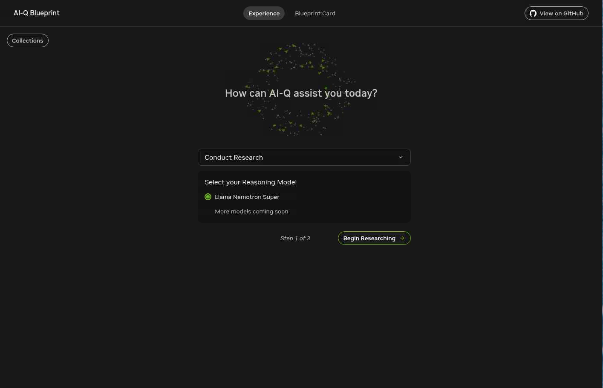

# Load Data and Test AI-Q Research Workflows on Oracle Kubernetes Engine (OKE)

## Introduction

In this lab, you load the default AI-Q document collections and begin testing the application end to end. You will import the sample datasets, open the AI-Q interface, generate research reports, and validate that document search and web-assisted research are working together as expected.

Estimated Time: 25 minutes

### Objectives

In this lab, you will:

- Load the default AI-Q document collections
- Access the AI-Q user interface
- Generate your first AI-Q research report
- Test different research topics and collections
- Review common troubleshooting checks for the deployed services

### About This Lab

This lab is where the platform becomes interactive. The earlier labs focused on deployment and service readiness. In this lab, you validate the learner experience by loading content into the system and using AI-Q to combine retrieval, reasoning, and web research into a structured output.

## Task 1: Load the Default Collections

AI-Q includes pre-curated biomedical and financial document collections that you can load into the platform for testing.

1. Confirm that you are still in the AI-Q Helm chart directory.

    ```bash
    <copy>cd ~/aiq-aira/</copy>
    ```

2. Apply the load job:

    ```bash
    <copy>kubectl apply -f load-files.yaml</copy>
    ```

3. Understand what this job does.

    The `load-files.yaml` job loads the pre-curated datasets into the Milvus vector database so they can be used by AI-Q during retrieval and report generation.

4. Monitor the data-loading job:

    ```bash
    <copy>kubectl logs -l job-name=load-files-nv-ingest -f</copy>
    ```

5. Wait for the job to complete.

    Loading typically takes 5 to 10 minutes, depending on cluster performance and startup conditions.

## Task 2: Open the AI-Q Interface

Once the data is loaded, retrieve the application URL and confirm that the interface is available.

1. Print the frontend URL from your terminal:

    ```bash
    <copy>printenv | grep -i AIRA_DOMAIN</copy>
    ```

2. Copy the returned URL into a new browser tab.

3. If you are using Luna Desktop, you can also locate the URL from the **Resources** tab.

4. Confirm that the AI-Q interface opens successfully.

    You should see features such as:

    - a document collection selector
    - a research topic input field
    - report generation controls
    - a web search toggle
    - an editing experience for refining generated results

    

## Task 3: Generate Your First Research Report

Now use AI-Q to generate a report that combines collection-based retrieval with optional web search.

1. In the AI-Q interface, select `Financial Dataset` from the collection list.

2. Enable the **Web Search** toggle so Tavily results are included in the workflow.

3. Enter the following research topic:

    `What are the key trends in commercial lending?`

    

4. Click **Select Sources** and review the source selection screen.

    

5. Click **Start Generating**.

6. Wait 2 to 3 minutes while AI-Q performs the workflow.

    During this process, the platform will:

    - generate research queries
    - search the selected document collection
    - search the web when enabled
    - synthesize findings across sources
    - generate the final report

7. Review the completed report and confirm that the output reflects both structured reasoning and source-based retrieval.

## Task 4: Edit and Refine the Output

AI-Q supports human-in-the-loop editing so you can refine the generated output instead of starting from scratch each time.

1. After the report is generated, click **Edit** on one of the sections.

2. Modify the content directly, add your own insights, or request AI-assisted rewrites if available in the interface.

3. Click **Regenerate Section** when you want the model to revise a specific portion of the report.

4. Save the updated section when you are satisfied with the result.

This review-and-refine workflow is valuable because it keeps the human user in control while still accelerating research and drafting.

## Task 5: Try Different Research Scenarios

To better understand the flexibility of AI-Q, test a few additional topics and collections.

1. Try an OCI infrastructure scenario.

    Use:

    - Topic: `Compare Oracle Cloud Infrastructure's AI capabilities with industry trends`
    - Collection: `OCI Documentation`
    - Web Search: enabled

    Expected outcome:

    AI-Q should combine information from your uploaded Oracle document with current web research to produce a broader analysis of OCI's AI positioning.

2. Try a biomedical scenario.

    Use:

    - Topic: `Recent advances in cancer immunotherapy`
    - Collection: `Biomedical Dataset`
    - Web Search: enabled

3. Try another financial scenario.

    Use:

    - Topic: `Impact of interest rate changes on commercial real estate`
    - Collection: `Financial Dataset`
    - Web Search: enabled

These variations help demonstrate that AI-Q is not tied to a single domain. The same platform can support different document sets, different prompts, and different research goals.

## Task 6: Upload Your Own Documents

You can also extend the system with your own document collections.

1. In the AI-Q interface, click **Upload Documents**.

2. Create a new collection or choose an existing one.

3. Upload one or more PDF documents.

4. Wait for ingestion to complete.

    Ingestion typically takes 1 to 2 minutes per document, depending on file size and system load.

5. Use the new collection in a research workflow and compare the results with the default datasets.

## Task 7: Troubleshoot Common Issues

If the application does not behave as expected, use the checks below.

1. AI-Q backend cannot connect to the Nemotron service.

    Symptoms:

    - AI-Q requests fail before report generation starts

    Checks:

    ```bash
    <copy>kubectl get pods -n rag | grep nim-llm</copy>
    <copy>kubectl get svc -n rag nim-llm</copy>
    ```

    The Nemotron pod should be running and the `nim-llm` service should exist.

2. The frontend cannot reach the backend.

    Symptoms:

    - the UI loads, but report actions fail
    - the interface shows backend connectivity errors

    Checks:

    ```bash
    <copy>kubectl get pods -n aira | grep -E "nginx|backend"</copy>
    ```

3. Web search results do not appear.

    Symptoms:

    - reports include only collection data and no Tavily-backed results

    Check that the Tavily configuration was applied correctly during deployment.

4. Collections are empty or not loaded.

    Symptoms:

    - default collections do not appear
    - collections show zero documents

    Checks:

    ```bash
    <copy>kubectl get jobs -n aira</copy>
    <copy>kubectl logs -n aira job/load-files-nv-ingest</copy>
    ```

5. Report generation is slow.

    Guidance:

    Initial runs may take longer because services may still be warming up or building optimized runtime artifacts. Later runs are usually faster.

## Conclusion

You have now completed the full end-to-end experience for this workshop. You deployed the RAG and AI-Q services, loaded document collections, opened the AI-Q interface, and generated research outputs that combine retrieved content with model reasoning and optional web search.

At this point, you have a working foundation for:

- enterprise document question answering
- AI-assisted research report generation
- human-in-the-loop editing and refinement
- multi-service AI deployment on Oracle Kubernetes Engine

From here, you can continue by uploading your own content, tuning the prompts and workflows, and exploring how this architecture can support research, analysis, and knowledge workflows in your own environment.

## Learn More

- [NVIDIA AI-Q Blueprint documentation](https://build.nvidia.com/nvidia/ai-research-assistant)
- [AI-Q GitHub repository](https://github.com/NVIDIA-AI-Blueprints/aiq-research-assistant)
- [Oracle Kubernetes Engine documentation](https://docs.oracle.com/en-us/iaas/Content/ContEng/home.htm)
- [NVIDIA NIM documentation](https://docs.nvidia.com/nim/)
- [Tavily documentation](https://docs.tavily.com/)

## Acknowledgements

- **Author** - Alejandro Casas, Oracle; Anurag Kuppala, NVIDIA
- **Contributors** - Julien Lehmann
- **Last Updated By/Date** - Codex, April 2026
